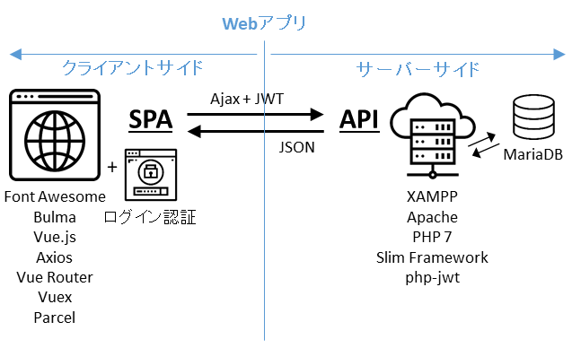

# Vue-Parcel-Slim-Authとは？

作成日 2019/03/27、更新日 2019/04/02

このWebアプリは、クライアントサイドは、[Vue.js](https://jp.vuejs.org/v2/guide/)と[Parcel](https://parceljs.org/)を使ってSPA（シングルページアプリケーション）を実現し、サーバーサイドは[Slim Framework](https://www.slimframework.com/)を使ってログイン認証を実現させている。



※ 本番環境（Linuxサーバー）へのインストール＆設定方法はスコープ外

## クライアントサイドの特長

- CSSフレームワークは、[Bulma](https://bulma.io/)を採用している
- JSフレームワークは、Vue.js + [axios](https://github.com/axios/axios) + [Vue-Router](https://router.vuejs.org/ja/) + [Vuex](https://vuex.vuejs.org/ja/)を採用している
- Parcelを使ってJSファイル、CSSファイルをそれぞれ1つにバンドルしている（まとめている）
- アイコンライブラリである[Font Awesome](https://fontawesome.com/)は、CDNを使って組み込んでいる

## サーバーサイドの特長

- サーバーフレームワークは、Slim Frameworkを採用している
- ミドルウェアに、[slim-jwt-auth](https://github.com/tuupola/slim-jwt-auth)を追加している
- サーバーは、静的ファイルを吐き出すか、APIとして働くかの2通りのみで、テンプレートは使っていない
- `/auth`APIは、ログイン認証に成功すると、JWT(JSON Web Token)を返す
- `/auth`以外のAPIは、Authorizationヘッダーにトークンを入れないとエラーを返す

## ローカルで動かすために必要なもの

- Windows 10（Macでの動作は検証していない）
- [XAMPP](https://www.apachefriends.org/jp/index.html)
  - Apache
  - MariaDB
  - PHP
- [Composer](https://getcomposer.org/)

### ローカルへのインストール方法

```bash
git clone git@github.com:isamusuzuki/vue-parcel-slim-auth.git
cd vue-parcel-slim-auth
composer install
```

- Xamppコントロールパネル ＞ Apacheの行 ＞ Configボタンをクリック ＞ httpd.confをクリック ＞ メモ帳でhttpd.confが開く
  - `DocumentRoot "C:/xampp/htdocs`という行を探す
  - `DocumentRoot "C:/Users/{your-name}/vue-parcel-slim-auth/application/public"`に変更する
  - `<Directory "C:/xampp/htdocs">`という行を探す
  - `<Directory "C:/Users/{your-name}/vue-parcel-slim-auth/application/public"`に変更する
  - 上書き保存してからメモ帳を終了する
- Xamppコントロールパネル ＞ MySQLの行 ＞ Startボタンをクリック ＞ MySQLが起動する
- Xamppコントロールパネル ＞ 右列 ＞ Shellボタンをクリック ＞ ターミナルが起動する
  - `mysql -u root`と叩いて、MySQLクライアントを開始する
  - setup_database.sqlファイルに書いてあるSQLクエリーを1つづつターミナルにコピペしてからエンターキーを叩く
  - 番号が振ってあるコメント行は除く、改行ではなくセミコロン(;)がクエリーの区切り
  - `\q`と叩いて、MySQLクライアントを終了する
  - `exit`と叩いて、ターミナルを終了する
- Xamppコントロールパネル ＞ Apacheの行 ＞ Startボタンをクリック ＞ Apacheが起動する
- ブラウザで`http://localhost/`を開く

## SPAを改修・追加開発するために必要なもの

- [Node.js](https://nodejs.org/ja/)

```bash
cd vue-parcel-slim-auth/client_side
npm install

# Parcelの開発サーバーを起動する
npm run dev
#=> ブラウザで`http://localhost:1234/`を開く

# ビルドをする前に、前のファイルを削除しておく
npm run clear

# 本番用ファイルをビルドする
npm run build
```

### SPAを開発する際の注意事項

- Parcelの開発サーバーがホストするのはSPAだけである
- API通信をローカルで実現するには、XamppのApacheサーバーを利用する必要がある
- Porcelの開発サーバーは`http://localhost:1234/`であり、XamppのApacheサーバーは`http://localhost:80/`である
- このままではCORS（クロス・オリジン・リソース・シェアリング）エラーが発生してしまい、API通信が実現できない

Xampp (Apache)のConfigをいじって、`<Directory>`項目の中に、以下を追加する

```text
Header set Access-Control-Allow-Origin "http://localhost:1234"
Header set Access-Control-Allow-Methods "GET, POST, DELETE, PUT, OPTIONS"
Header set Access-Control-Allow-Headers "Content-Type, Authorization"
Header set Access-Control-Allow-Credentials "true"
```

## その他

- このWebアプリにログインできるID/PWの組み合わせは、 `user/user@123`

## ファイルディレクトリ構成

```text
--vue-parcel-slim-auth
    |
    |--application/   ... サーバーサイドのファイル群
    |   |
    |   |--public/    ... Apacheサーバーのドキュメントルート
    |   |   |
    |   |   |--spa/   ... ビルドされたSPAの置き場
    |   |   |   |
    |   |   |   `--app1/
    |   |   |       |--app1.xxxxxxxx.css ... バンドルされたCSSファイル
    |   |   |       |--app1.xxxxxxxx.js  ... バンドルされたJSファイル
    |   |   |       `--index.html        ... SPAの起動ファイル
    |   |   |
    |   |   |--.htaccess ... Apache用の設定ファイル
    |   |   `--index.php ... Slim Frameworkの起動ファイル
    |   |
    |   `--src/                 ... Slim Frameworkのファイル群
    |       |--dependencies.php ... 依存性注入コンテナ
    |       |--middleware.php   ... ミドルウェア
    |       |--routes.php       ... ルーティング
    |       `--settings.php     ... 設定ファイル
    |
    |--client_side/ ... クライアントサイドの開発環境
    |   |
    |   |--app1/
    |   |   |--components/  ... 子・孫コンポーネントのファイル群
    |   |   |--modules/     ... モジュールのファイル群
    |   |   |--pages/       ... ページコンポーネントのファイル群
    |   |   |--App.vue      ... 親コンポーネント
    |   |   |--index.html   ... SPAの起動ファイル
    |   |   `--index.js     ... バンドルの基底となるJSファイル
    |   |
    |   `--package.json     ... npm用の設定ファイル
    |
    |--composer.json ... Composer用の設定ファイル
    |--README.md     ... このファイル
    `--setup_db.sql  ... DBテーブルを作成するクエリー
```
